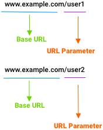

#### [Code](https://codesandbox.io/s/react-route-url-parameter-bm0v4)

```jsx
  <Route path="/:userID" >
    <Component />
  </Route>
  
  
{/* exract param using `useParams` from 'react-router-dom' */}

const { userID } = useParams();
```
